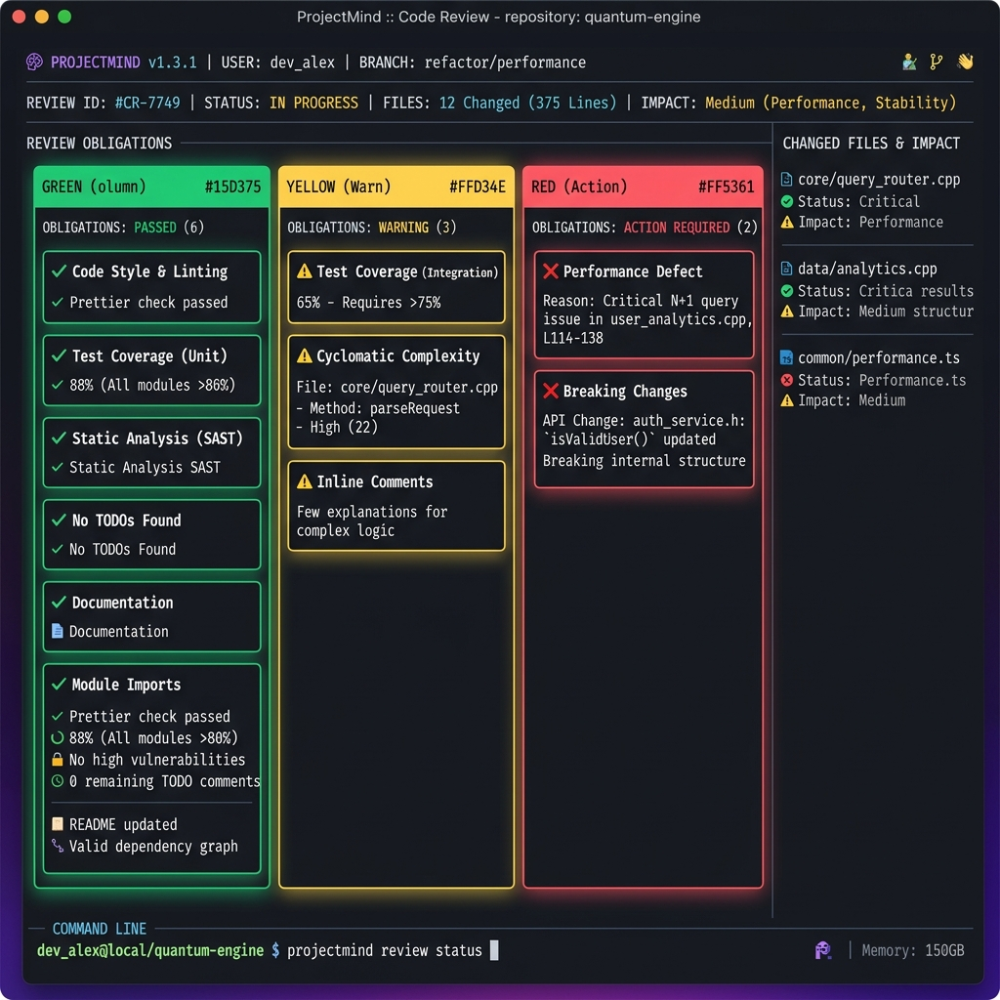
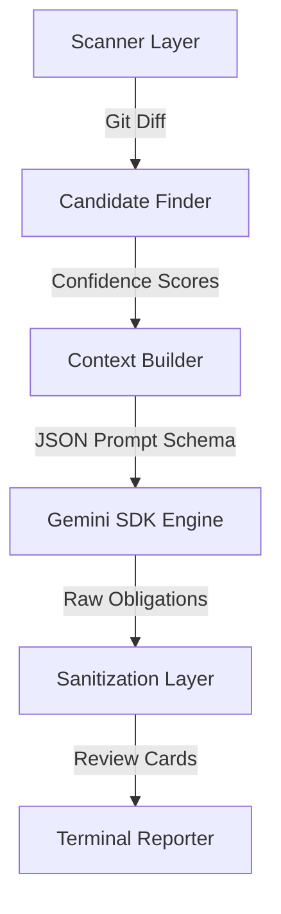

# ProjectMind 🧠

> A localized Change Impact & Review Obligation Engine that maps system dependencies and predicts downstream human review duties before code shifts turn into silent bugs.

---

## 📸 Visual Demos

Below is a visualization of ProjectMind running in a dark-mode terminal environment, organizing and prioritizing review obligations into confidence-coded cards:



---

## ⚡ Project Description

ProjectMind is a developer tool designed to assist software teams in identifying review obligations that arise when code changes are made. 

Every meaningful modification in a software project creates **downstream obligations** elsewhere in the codebase. For example, changing a default port value might require updating docker-compose setups, environment templates, or developer documentation. ProjectMind solves this problem by deterministically building a workspace snapshot, traversing configuration and interface connections, and running structured AI-powered analysis to output actionable checklists of what needs human review.

---

## 🛠️ Detailed Setup Guide

Follow these steps to configure and run ProjectMind locally:

### 1. Prerequisites
Ensure you have **Python 3.11+** and the **`uv`** package manager installed.
*   **Install `uv` (Windows PowerShell):**
    ```powershell
    powershell -ExecutionPolicy ByPass -c "irm https://astral.sh/uv/install.ps1 | iex"
    ```

### 2. Configure environment
Clone this repository and navigate to its root folder. Set the required API key for structured Gemini logic:
*   **Command Line (PowerShell):**
    ```powershell
    $env:GEMINI_API_KEY="your-gemini-api-key"
    ```
*   **Command Line (Linux/macOS):**
    ```bash
    export GEMINI_API_KEY="your-gemini-api-key"
    ```

### 3. Run a Review
Run ProjectMind directly on the active repository using `uv`:
```powershell
uv run projectmind review
```

---

## 🎛️ Technology Summary

ProjectMind is built using a modern, lightweight Python stack:
*   **Python 3.11+**: Core programming language.
*   **uv**: Dependency management and fast environment execution.
*   **FastAPI & Pydantic**: Structured response schema configurations.
*   **Google GenAI SDK**: Connection wrapper to `gemini-2.5-flash` model.
*   **Click**: Elegant Command Line Interface routing.
*   **pytest**: Unit and E2E validation test suites.

---

## 📐 Architecture Highlights

ProjectMind uses a decoupled six-layer pipeline to map changes to review cards:



*   **Scanner:** Deterministically extracts changed lines from Git diffs, skipping test caches and ProjectMind report files.
*   **Candidate Finder:** Uses regex heuristics to identify configuration overlaps, database settings, and matching test suites.
*   **LLM Review Engine:** Prompts the `gemini-2.5-flash` model to analyze the diff against candidate files.
*   **Validator:** Sanitizes structured JSON against file existence rules, filtering out obligations that lack evidence.

---

## 🤝 Contribution Guidelines

We welcome community contributions to improve ProjectMind!
1.  **Fork the repository** and create a feature branch.
2.  **Ensure tests pass** before submitting a Pull Request:
    ```powershell
    uv run --with pytest pytest tests/
    ```
3.  **Adhere to Code Standards**: Follow Python PEP 8 conventions.
4.  **Document new extractors**: If adding static regex parsers, document the target configurations in the README.

---

## 📄 License

This project is licensed under the terms of the MIT License. See the [LICENSE](LICENSE) file for the full license text.
